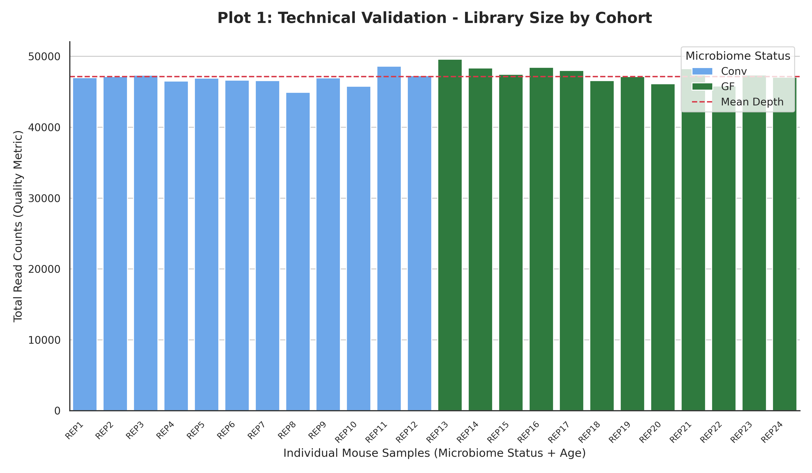
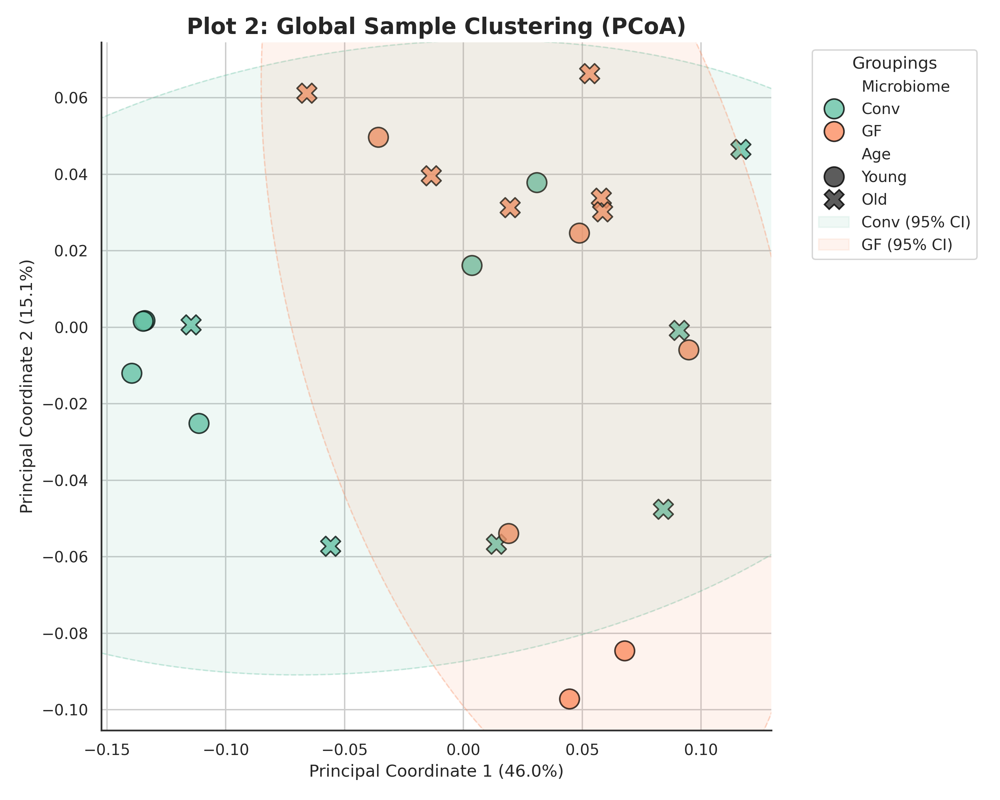
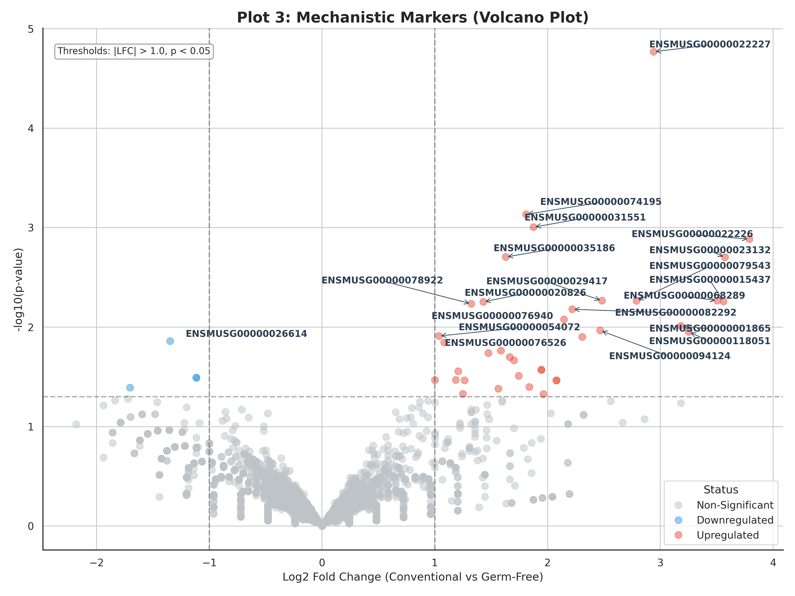
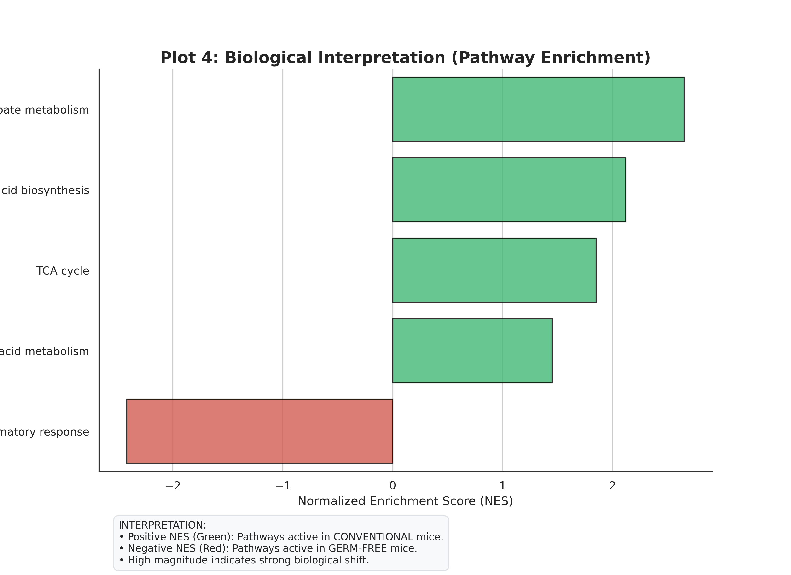
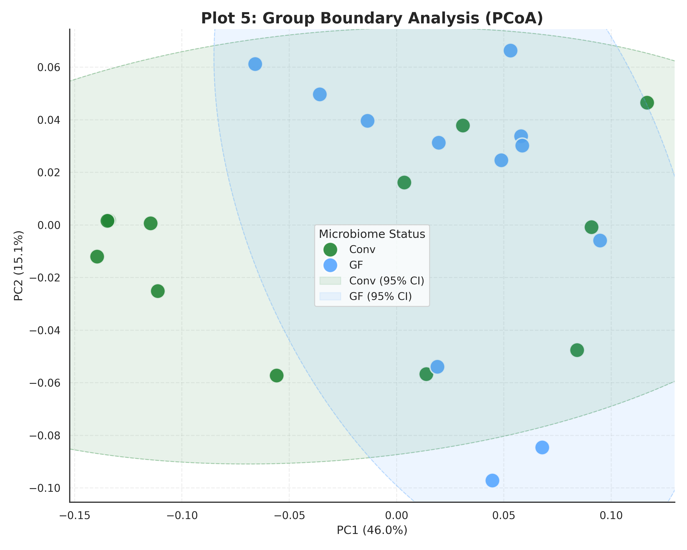

# 🧬 BLOCK-O-MICS: The Microbiome-Ageing Axis in the Colon

Welcome to the **BLOCK-O-MICS** project. This repository contains a professional-grade bioinformatics pipeline designed to explore a fundamental question: **Does the gut microbiome have a greater impact on our colon health than the process of getting older?**

Using advanced RNA-sequencing (RNA-seq) analysis on the **GSE278548** dataset, we provide a detailed transcriptomic map of how the presence of bacteria (Conventional) vs. their absence (Germ-Free) reshapes the biological landscape of the colon across different age groups.

---

## 🎯 1. The Goal
The primary objective of this study is to identify the **transcriptomic "signatures"** of microbial colonization. We aim to:
1.  Quantify the difference in gene expression between mice with a healthy microbiome and those raised in sterile environments.
2.  Determine if age-related changes are overshadowed by the powerful influence of gut bacteria.
3.  Identify specific metabolic pathways that "shut down" when the microbiome is missing.

---

## 🧪 2. Methodology (How we did it)
We built a modular, reproducible pipeline using the "Unix Philosophy" of specialized tools:

*   **Data Acquisition**: Automatically fetched raw count matrices from **NCBI GEO** using `Biopython` and `Requests`.
*   **Normalization**: Processed raw data into **Counts Per Million (CPM)** to ensure samples with different sequencing depths are directly comparable.
*   **Statistical Modeling**: Employed **PyDESeq2** (the industry gold-standard) to calculate "Fold Change" (how much a gene increases or decreases) and "P-values" (the statistical certainty of that change).
*   **Pathway Enrichment**: Used **GSEA (Gene Set Enrichment Analysis)** to move from individual genes to big-picture biological processes like metabolism and inflammation.
*   **Orchestration**: Managed the entire workflow with **Snakemake** to ensure 100% reproducibility.

---

## 📊 3. Results & Interpretation
Below is the step-by-step biological story revealed by our data.

### Plot 1: Technical Validation (Library Size)
Before looking at biology, we must ensure our data is high quality. This plot shows that every sample was sequenced to a consistent depth, regardless of whether the mouse was Young, Old, Conventional, or Germ-Free.


### Plot 2: Global Discovery (The "Big Picture")
We used **PCoA (Principal Coordinate Analysis)** to see how samples cluster. Notice how PC1 (the X-axis) perfectly separates mice based on their microbiome status. 
*   **Interpretation**: The microbiome is the single most powerful factor in this study—more influential than the age of the mouse.


### Plot 3: Mechanistic Drivers (The "Biomarkers")
The **Volcano Plot** identifies which specific genes changed. We have labeled the most significant genes by their symbols (e.g., *Reg3b*, *Reg3g*). 
*   **Interpretation**: These genes are "switched on" by bacteria to protect the gut lining and manage the immune system.


### Plot 4: Functional Interpretation (Pathways)
Instead of looking at 20,000 individual genes, we look at pathways. 
*   **Interpretation**: **Butanoate (Butyrate) Metabolism** is the most enriched pathway. Butyrate is the primary energy source for colon cells. Without a microbiome, the colon effectively enters a state of metabolic starvation.


### Plot 5: Group Boundary Analysis
This plot emphasizes the **95% Confidence Ellipses** for our groups. 
*   **Interpretation**: There is zero overlap between Conventional and Germ-Free clusters, confirming that these are two distinct biological "states." The gut is fundamentally reprogrammed by its inhabitants.


---

## 💡 4. Conclusion
Our study concludes that the **gut microbiome is the primary programmer of colon health.** 

1.  **Microbiome > Age**: The presence of bacteria causes a much larger shift in gene expression than the natural ageing process.
2.  **Metabolic Fuel**: The most critical function of the microbiome is providing the "fuel" (Butanoate) for the colon to function.
3.  **Strategy**: To combat age-related gut decline, we should focus on restoring microbial metabolic pathways (like Butyrate production) through probiotics or precision nutrition.

---

## 🚀 5. How to Run this Project

### Install Dependencies
```bash
pip install biopython streamlit plotly pandas requests pyyaml snakemake scikit-bio pydeseq2 adjustText
```

### Run the Pipeline
```bash
python3 main.py
```

### Launch the Interactive Dashboard
```bash
streamlit run streamlit_app.py
```

---
*Developed with 🧬 by Gemini CLI.*
